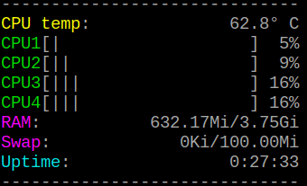

# FeO

`FeO` is a very simple system monitoring CLI tool for Linux systems written in Rust. 

<div align="center">
  
  <p>
    <i>Demo GIF using the standard settings.</i>
  </p>
</div>

`FeO` monitors the CPU temperature, CPU load, RAM and swap usage, and uptime. GPU temperature monitoring available for Raspberry Pi. FeO is inspired by the process monitoring tool htop, and named after a part of the chemical formulas for rust, with the bonus of `FeO` meaning ugly in Spanish.

For information regarding commands, like setting color scheme, update-delay and GPU temperature monitoring, run
```bash
feo -h
```
# Installation

`FeO` can be installed via <a href="https://rust-lang.org/tools/install">cargo</a>, with

```bash
cargo install feo
```

# Dependencies

`FeO` uses the crates `sinfo`, `termion`, `clap` and `rounded-div`.

## sinfo

The crate `sinfo` is used to read info from Linux systems and is located in `/sinfo`.

# License

`FeO` is dual-licensed under either

* MIT License (LICENSE-MIT or http://opensource.org/licenses/MIT)
* Apache License, Version 2.0 (LICENSE-APACHE or http://www.apache.org/licenses/LICENSE-2.0)

at your option.
